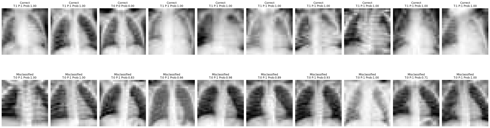

# Chest X-Ray Pneumonia Classification  
EfficientNet-Based Clinical Image Classification with Docker Reproducibility  



---

## 📌 Project Overview

This project implements a deep learning pipeline for binary classification of chest X-ray images (Normal vs Pneumonia) using EfficientNet transfer learning.

The goals of this project were to:

- Design and train a convolutional neural network for medical image classification  
- Apply transfer learning using EfficientNet  
- Perform structured model evaluation (confusion matrix, ROC curve, AUC, misclassification analysis)  
- Ensure reproducibility through Docker containerization  

This project demonstrates an end-to-end machine learning workflow, from preprocessing and model training to evaluation and reproducible deployment.

---

## 🧠 Model Architecture

- Backbone: EfficientNet (Transfer Learning)
- Input: 28×28 grayscale images (resized to 224×224 RGB)
- Output: Binary classification (Sigmoid activation)
- Loss: Binary Crossentropy
- Metrics: Accuracy, AUC

Transfer learning was applied to leverage pretrained image representations while adapting to medical image classification.

---

## 📊 Dataset

- Dataset: PneumoniaMNIST (MedMNIST collection)
- Classes:
  - 0: Normal
  - 1: Pneumonia
- Image size: 28×28 grayscale (resized for model input)

⚠ Important Note:  
PneumoniaMNIST is a low-resolution benchmark dataset (28×28). While useful for experimentation and pipeline validation, it does not reflect real-world clinical image resolution or variability.

---

## 📈 Evaluation Results

Test Performance:

- Accuracy: 0.8622  
- AUC: 0.9372  
- Test Loss: 0.6404  

Confusion Matrix:

|                | Predicted Normal | Predicted Pneumonia |
|----------------|-----------------|--------------------|
| True Normal     | 150 | 84 |
| True Pneumonia  | 2 | 388 |

### Observations

- High recall for Pneumonia detection  
- Lower recall for Normal class  
- Slight bias toward predicting Pneumonia  

The evaluation pipeline automatically generates:

- Misclassification visualization  
- Confusion matrix  
- ROC curve  
- Precision / Recall / F1-score  

This allows structured error analysis rather than relying solely on accuracy.

---

## 🔍 Error Analysis

The model evaluation includes:

- Visual inspection of misclassified images  
- False Positive and False Negative analysis  
- ROC curve assessment  
- Class-specific performance metrics  

This is important for medical AI, where sensitivity and specificity have different clinical implications.

---

## 🐳 Reproducibility with Docker

To ensure full reproducibility of the evaluation pipeline:

```bash
docker build -t pneumonia-image-eval .
docker run --rm -v ${PWD}/models:/app/models -v ${PWD}/outputs:/app/outputs pneumonia-image-eval
```

The container automatically:

- Loads the trained model  
- Reconstructs the dataset  
- Runs evaluation  
- Saves outputs  

Generated files:

- outputs/misclassified_examples.png  
- outputs/confusion_matrix.png  
- outputs/roc_curve.png  
- outputs/loss_acc_auc.txt  

This demonstrates reproducible ML deployment practices.

---

## 🛠 Tech Stack

- Python 3.10  
- TensorFlow 2.18  
- TensorFlow Datasets  
- NumPy  
- Scikit-learn  
- Matplotlib  
- Docker  

---

## 🔬 Future Directions (Clinical Perspective)

While this project validates a complete deep learning pipeline, PneumoniaMNIST is a simplified benchmark dataset.

To move toward clinically meaningful AI development, future work would include:

### 1️⃣ High-Resolution Clinical X-ray Datasets
- Train on real-world datasets such as:
  - NIH ChestX-ray14  
  - CheXpert  
  - RSNA Pneumonia Detection Challenge  
- Use full-resolution radiographs (e.g., 1024×1024)  
- Evaluate cross-institution generalization  

### 2️⃣ Class Imbalance & Threshold Optimization
- Apply class weighting or focal loss  
- Optimize decision threshold for clinically relevant sensitivity targets  

### 3️⃣ Model Calibration
- Evaluate calibration curves  
- Apply temperature scaling  
- Ensure reliable probability outputs for decision support  

### 4️⃣ Explainability
- Integrate Grad-CAM or saliency maps  
- Validate that model attention aligns with radiological patterns  
- Improve interpretability for clinical use  

### 5️⃣ External Validation
- Test robustness on out-of-distribution datasets  
- Assess domain shift and generalizability  

This progression would transition the project from benchmark experimentation to clinically applicable AI research.

---

## 🏥 Clinical Impact Perspective

For medical AI systems, performance alone is insufficient.

Clinical deployment requires:

- Reliable sensitivity for disease detection  
- Transparent failure analysis  
- Probability calibration  
- External validation  
- Robustness across data sources  

This project establishes the technical foundation (modeling, evaluation, reproducibility) necessary to progress toward clinically deployable AI systems.

---

## 🎯 Purpose

This project was developed to demonstrate:

- Applied deep learning in medical imaging  
- Structured evaluation beyond simple accuracy  
- Transfer learning implementation  
- Containerized reproducible ML workflows  
- Awareness of clinical translation challenges  

---

## Author

Koki Ohira  
MSc Artificial Intelligence in KCL
